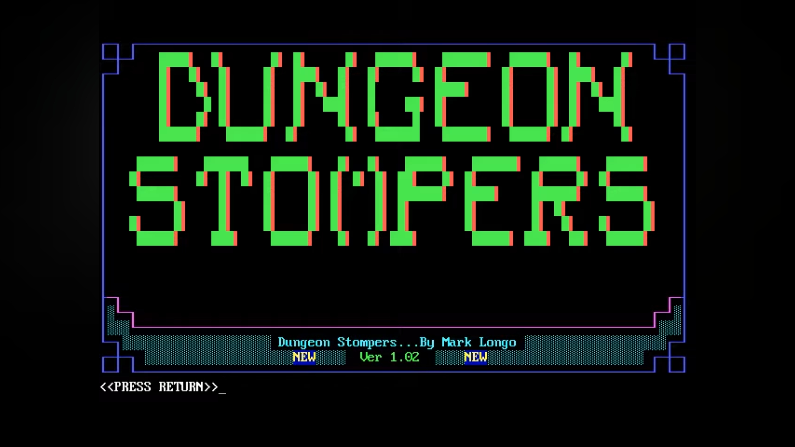
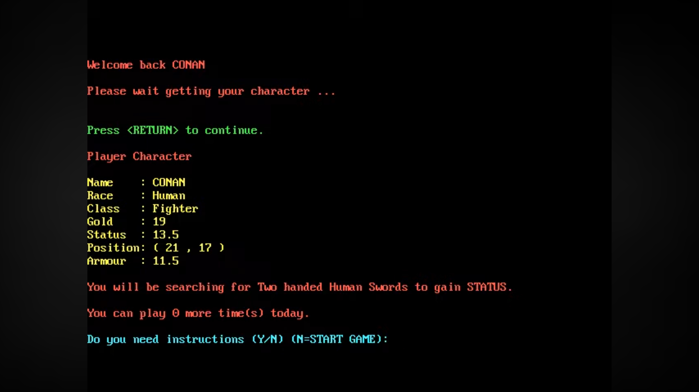
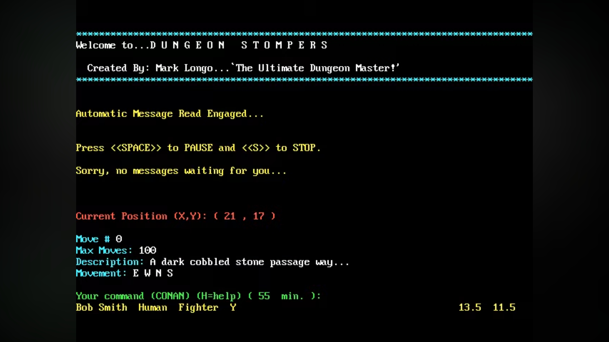
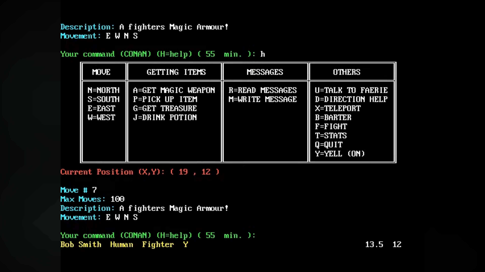
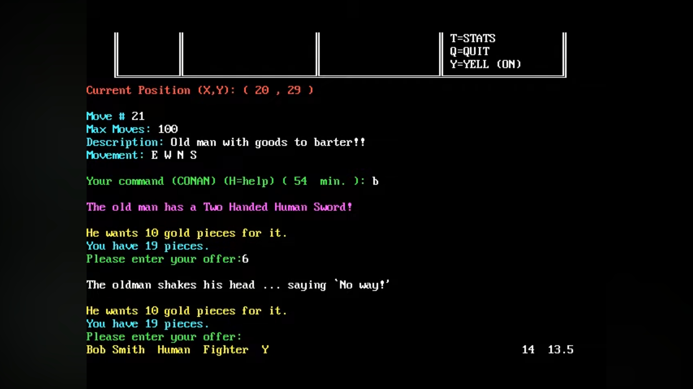

# Dungeon Stompers

> **A multiplayer BBS door game written in BASIC — preserved from 1989.**

```
********************************************************************************
Welcome to...D U N G E O N   S T O M P E R S
  Created By: Mark Longo...`The Ultimate Dungeon Master!'
********************************************************************************
```

[](#)
[](#)
[](#)
[](#)
[](#)

Dungeon Stompers is a real-time, multiplayer dungeon-crawl **BBS door game** developed in the summer of 1988 and released on **April 24, 1989**. Players connected to a bulletin board system (BBS) via modem, chose a race and class, and explored a shared dungeon — fighting monsters, collecting weapons, casting spells, and battling each other in real time.

This repository preserves the original source code exactly as distributed, as a piece of early online gaming history.

> **Original documentation:** [DS.DOC](STOMP/DS.DOC) is the original Version 1.02 manual dated **April 24, 1989**. It covers installation, system requirements, BBS door setup, multi-node operation, events, editor and map tools, and the full file reference.

---

## Table of Contents

- [Screenshots](#screenshots)
- [Features](#features)
- [Gameplay](#gameplay)
- [Character System](#character-system)
- [Technical Details](#technical-details)
- [File Reference](#file-reference)
- [Running the Game](#running-the-game)
- [Historical Context](#historical-context)
- [Credits](#credits)

---

## Screenshots







---

## Features

- **Multiplayer** — multiple BBS callers share the same dungeon world simultaneously (multi-node support)
- **Four playable races** — Human, Elf, Dwarf, Halfling, each with race-specific weapons and magic items
- **Two character classes** — Fighter and Magic-User, with distinct abilities
- **Turn-based exploration** on a grid map with ASCII/ANSI dungeon rendering
- **Combat system** — fight monsters that roam the dungeon or challenge other players
- **Item economy** — weapons, magic items, potions, scrolls, gold, and a barter merchant
- **ANSI color graphics** support for callers with ANSI-capable terminals
- **Sysop admin tools** — dungeon editor, monster insertion, player management, event scheduling
- **Modem speed support** — 300 through 38400 baud
- **PCBoard BBS** compatibility included

---

## Gameplay

Players navigate the dungeon using cardinal direction commands. Each session has a move limit set by the sysop.

| Command | Action |
|---------|--------|
| `N` / `S` / `E` / `W` | Move north / south / east / west |
| `G` | Get gold |
| `P` | Pick up a weapon (must match your race/class) |
| `A` | Acquire armour or gauntlet (Fighters only) |
| `J` | Drink a potion |
| `F` | Fight a player in your location |
| `B` | Barter with the merchant |
| `C` | Cast a spell (Magic-Users only) |
| `I` | Read a magic scroll (Magic-Users only) |
| `U` | Interact with a Faerie |
| `T` | Teleport |
| `M` | Read messages |
| `R` | Read the message board |
| `X` | View stats |
| `Q` | Quit and save |

### Dungeon Tiles

| Symbol | Description |
|--------|-------------|
| `.` | Dark cobbled stone passage |
| `A` | Gold |
| `B–E` | Race-specific weapons |
| `F–I` | Race-specific magic items |
| `J` | Magic Scroll |
| `K` | Beautiful Faerie |
| `L` | Fighter's Magic Armour |
| `M` | Gauntlet of Strength |
| `N` | Pit (dangerous!) |
| `O` | Potion of Protection |
| `R` | Merchant (barter goods) |
| `Z` | Another player |

---

## Character System

### Races
| Race | Weapon | Magic Item |
|------|--------|------------|
| Human | Two-Handed Human Sword | Magic Human's Staff |
| Elf | Elven Sword | Magic Elven Stones |
| Dwarf | Dwarvish War Hammer | Magic Dwarvish Gem |
| Halfling | Halfling's Short Sword | Magic Halfling Cloak |

### Classes
- **Fighter** — Can acquire Magic Armour and the Gauntlet of Strength
- **Magic-User** — Can cast spells and read magic scrolls

---

## Technical Details

- **Language:** GW-BASIC / QuickBASIC (line-numbered BASIC)
- **Platform:** MS-DOS
- **BBS Interface:** Serial COM port via modem (COM1/COM2), 300–38400 baud
- **BBS Software:** PCBoard compatible (see `PCB/`)
- **Multi-node:** Shares dungeon state via flat `.DAT` files
- **ANSI:** Optional ANSI escape code color rendering

### Architecture

The game is split across several chained BASIC modules:

```
LOGON.BAS    → Entry point: modem handshake, player login
STOMP.BAS    → Main game loop: dungeon movement, items, combat
MONSTER.BAS  → Monster encounter logic
MAP.BAS      → Dungeon map renderer (ANSI/ASCII)
EVENT.BAS    → Scheduled daily events
ORDER.BAS    → Sysop ordering / registration
SETUP.BAS    → Sysop admin menu
DS-MAIN.BAS  → Maintenance: daily cleanup, player expiry
EDITOR.BAS   → Dungeon map editor
PASS.BAS     → Password management
RATE.BAS     → Player rating / leaderboard
BEST.BAS     → Hall of fame / best players
TIME.BAS     → Move/time limit management
MDM.BAS      → Modem carrier detection
LOCAL.BAS    → Local (non-modem) play mode
SAFE.BAS     → Safe-mode fallback
CLEAN.BAS    → File cleanup utilities
SEEK/        → File search utilities
```

---

## File Reference

| File | Purpose |
|------|---------|
| `DRIVE.DAT` | Master configuration (paths, event flags, sysop settings) |
| `PLAY.DAT` | Player records |
| `NAME.DAT` | Player name index |
| `LOCATION.DAT` | Player positions in the dungeon |
| `BOARD.DAT` | Dungeon grid layout |
| `MDM.DEF` | Modem hang-up string definition |
| `BAUD.DAT` | Current caller baud rate |
| `CALL.DAT` | Last caller info |
| `MACRO.DAT` | Function key macros |
| `DS.DEF` | Registered sysop name |
| `DS.BAT` | Game launch batch script |
| `EVENTS.BAT` | Event scheduler batch script |
| [`DS.DOC`](STOMP/DS.DOC) | Original game documentation |

---

## Running the Game

Dungeon Stompers requires a **DOS environment** and a BASIC runtime. The most practical approach today is emulation.

### With DOSBox

1. Install [DOSBox](https://www.dosbox.com/) or [DOSBox-X](https://dosbox-x.com/)
2. Mount the `STOMP/` directory:
   ```
   MOUNT C C:\path\to\DungeonStompers\STOMP
   C:
   ```
3. Start Dungeon Stomp:
   ```
   LOGON.EXE
   ```
4. For local (non-modem) play, set baud to `0` in `BAUD.DAT` — this chains to `LOCAL.BAS`

### BBS Integration (Historical)

On a live BBS, the sysop would configure a door entry in their BBS software pointing to `DS.BAT`, which launched `LOGON.BAS` and passed the active COM port and baud rate via `COM.DAT` and `BAUD.DAT`.

---

## Historical Context

BBS door games were the **multiplayer online games of the 1980s and early 1990s**. Before the World Wide Web, players dialed into bulletin board systems over telephone lines and took turns playing shared games. Dungeon Stompers was notable for supporting **true simultaneous multi-node play** — multiple callers could occupy the same dungeon at the same time and interact.

This was released the same year as other landmark BBS doors. The game was distributed as shareware from Cambridge, Ontario, Canada, with a support BBS at `1-519-658-6433`.

If you ran a BBS in the late 1980s or called one that hosted Dungeon Stompers, this repository is for you.

---

## Credits

**Programming & Documentation:** Mark Longo  
**Version:** 1.02  
**Released:** April 24, 1989  
**Origin:** Cambridge, Ontario, Canada

---

*Preserved for retro gaming history. If you have memories of playing Dungeon Stompers on a BBS, open an Issue — we'd love to hear your story.*

